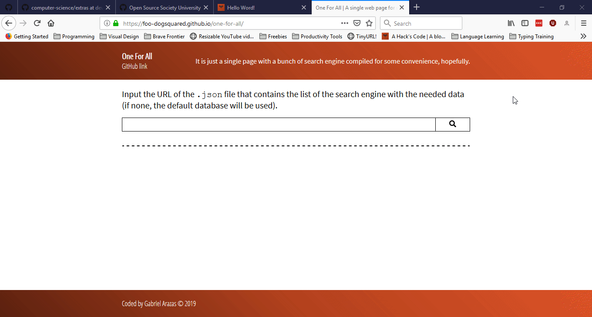

# remote-repo-author-viewer
Pretty self-explanatory, right?

Want to view profiles quickly when visiting some developer-oriented websites? Here's one way to do that.

## To-dos / User stories
- It should able to detect reserved words for each site in case account URLs and their URL of the reserve words are the same origin
- Add support for [GitLab](https://gitlab.com) and [GitLab pages](https://about.gitlab.com/product/pages/)
- Add support for [SourceForge](http://sourceforge.net/), if possible
- Add support for [Gitote](https://gitote.in)
- Add support for [Repl.it](https://repl.it)
- Add support for [Codepen](https://codepen.io)

## How to contribute?
If you find any bugs or want to request for a feature or an improvement, you can file an issue on this repo.

If you're contributing through code, feel free to do so. Just take note we're taking a [code of conduct](./code-of-conduct.md) over here.

You can also contribute by donating, if you appreciate my work. Just click on the big button below and hit me up with another coffee that I can buy (don't worry, it's not from Starbucks or any fancy coffee shops 😋):

